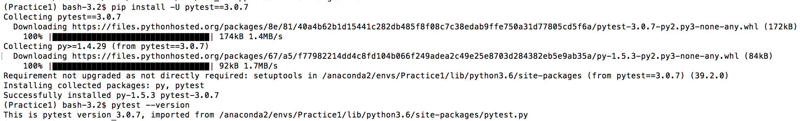

問題1 環境熟悉
----

參考
- https://pip.pypa.io/en/stable/
- https://docs.pytest.org/en/latest/getting-started.html
- https://virtualenv.pypa.io/en/stable/

請試著在 python 2.7.13 或 python 3.5.3 下，用 pip 安裝 pytest 套件, 版本需為 3.0.7。
（建議使用 virtualenv 或任意可讓環境獨立的套件, 如 docker）

1. 簡單描述如何安裝指定版本的 python binary
> pip install -U pytest==3.0.7
2. 安裝完 pytest 3.0.7 後, 請用 pip 將當前環境印出並付上


----

問題2 除錯
----
```python
def extend_list(val, l=[]):
    l.append(val)
    return l

def test_extend_list():
    # 1
    assert extend_list(1) == [1]
    # 2
    assert extend_list(2, []) == [2]
    # 3
    assert extend_list(3) == [3]

if __name__ == '__main__':
    test_extend_list()
```

1. 請問 `if __name__ == '__main__':` 的用意為何？
> 當此段程式直接被執行時，會直接由__main__作為模擬程式進入點

2. 這段 code 會在第三個 assert 出錯了, 為什麼？
> 第一個 assert 已經將 l append 1, 在第三個 assert 因為未重新定義新陣列，l 會再 append 3，並回傳為 [ 1, 3 ]

----

問題3 簡答
----

問題
1. 請試著簡述你在 python 2 中如何處理 str 與 unicode 的轉換？
> encode('utf-8'), decode('utf-8')

2. python 3 為何不需再考慮上述問題？
> python 3 中表示 str 型態的即為 unicode

3. 若要用 python 開一個 MVC project(比方說 web server), 你的資料夾會打算如何配制？
- AppName
    - config.py
    - /app
        - __init__.py
        - module
            - controller
            - model
            - form
        - template

----

問題4 實做
----

請試著實做一個 decorator，能夠接受兩個 argument type datetime，
若 function 運行當下的時間是在這兩個時間內, 則 `print('in time!')`。
（兩個 datetime 順序不一定要按 ascending 排序）

```python
import time   
import datetime                                             

def timeit(method):
    def timed(*args, **kw):
        result = method(*args, **kw)
        return result

    return timed

@timeit
def inTime(a, b):
    try:
        a_time = time.strptime(a, '%H:%M:%S')
        a_time_all = ('00' + str(a_time.tm_hour))[-2:] + ':' + ('00' + str(a_time.tm_min))[-2:] + ':' + ('00' + str(a_time.tm_sec))[-2:]

        b_time = time.strptime(b, '%H:%M:%S')
        b_time_all = ('00' + str(b_time.tm_hour))[-2:] + ':' + ('00' + str(b_time.tm_min))[-2:] + ':' + ('00' + str(b_time.tm_sec))[-2:]

        timeNow = datetime.datetime.now()

        if timeNow.strftime("%H:%M:%S") >= a_time_all and timeNow.strftime("%H:%M:%S") <= b_time_all:
            print ('in time')
        if timeNow.strftime("%H:%M:%S") <= a_time_all and timeNow.strftime("%H:%M:%S") >= b_time_all:
            print ('in time')
    except Exception as e:
        print ('convert datetime error')

inTime('07:59:51', '01:59:51')
```
